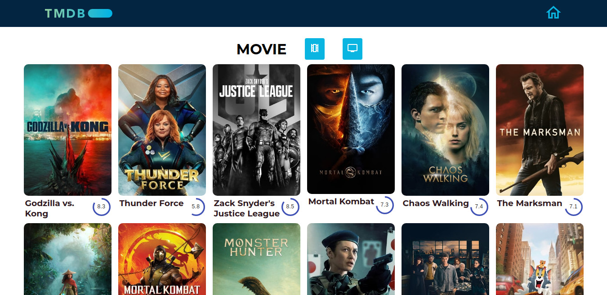
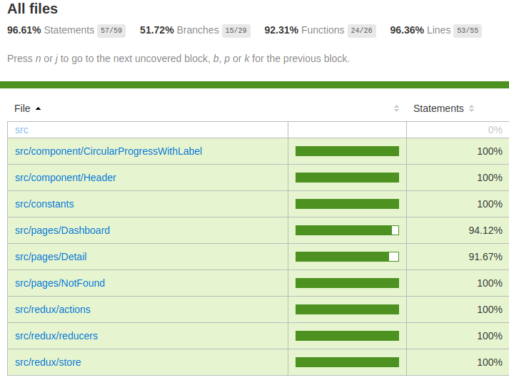

# The Movie Database App

This app shows you in the main page the popular movies or the popular TV shows. Clicking in each one will display the information of the item and a collection of related media.

You can see the app working [here](https://the-movie-database-app.web.app/)

The data is pull from the API [The movie Database V3](https://developers.themoviedb.org/3/)

## Tech Stack & Libraries

This frontEnd project was developed using:
* [TypeScript](https://www.typescriptlang.org/)
* [React](https://reactjs.org/)
* [Redux](https://redux.js.org/)
* [Jest](https://jestjs.io/)
* [HTML5](https://html.spec.whatwg.org/)
* [SASS](https://sass-lang.com/)
* [Material-UI](https://material-ui.com/)

##  Installing the app in your computer

1. Clone the repository in to your computer.
2. Create a .env file with your API key (see .env-example)
3. Install dependencies:
Use `yarn install` or `npm  install`  
4. Run the app:
Use `yarn start` or `npm start`
Runs the app in the development mode.\
Open [http://localhost:3000](http://localhost:3000) to view it in the browser.
5. Run the unit testing:
Use `yarn test` or `npm test` to run the tests.

